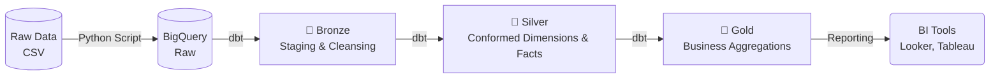

# 🏗️ Modern Data Warehouse with dbt (Medallion Architecture)


## 📌 Project Overview
This project demonstrates a production-grade batch data pipeline using the **Medallion Architecture (Bronze, Silver, Gold layers)** and **dbt (data build tool)**. It extracts raw e-commerce data, loads it into a cloud data warehouse (Google BigQuery), and transforms it into business-ready analytical tables optimized for BI tools.

## 📊 Dataset: Olist E-commerce
The project utilizes the [Brazilian E-Commerce Public Dataset by Olist](https://www.kaggle.com/datasets/olistbr/brazilian-ecommerce), containing 100k+ anonymized orders from 2016 to 2018. It includes rich information spanning from order status, price, payment, and freight performance to customer location, product attributes, and reviews.

## 🏛️ Architecture & Data Modeling
The pipeline follows a strict **Medallion Architecture** to progressively structure and ensure the quality of the data:



### 🥉 Bronze Layer (Staging)
*Objective: Light cleaning, standardization, and rigorous data quality testing.*
* `stg_customers`, `stg_orders`, `stg_order_items`, `stg_sellers`, `stg_products`, etc.
* Validates upstream data integrity via dbt tests (`unique`, `not_null`).
* Handles data type casting (e.g., strings to `TIMESTAMP` or `FLOAT64`) and minor deduplication (e.g., resolving duplicate geolocation co-ordinates).

### 🥈 Silver Layer (Conformed Dimensions & Facts)
*Objective: Enforce relationships, apply business logic, and create an analytics-ready foundation.*
* **Dimensions:** `dim_customers`, `dim_sellers`, `dim_products` (enriched with English translations).
* **Facts:** `fct_orders` (consolidating order headers, payment aggregations, and average review scores), `fct_order_items`.

### 🥇 Gold Layer (Data Marts)
*Objective: Denormalized, highly aggregated data marts perfect for immediate reporting.*
* 📈 **`mrt_sales_by_category`**: Aggregates revenue, freight cost, and volume by month and English product category.
* 🏆 **`mrt_seller_performance`**: Seller lifetime value, tracking revenue, unique customers, and average delivery times.
* 🎯 **`mrt_customer_rfm`**: Actionable **RFM (Recency, Frequency, Monetary)** segmentation scoring (1-5) for targeted marketing.
* 🚚 **`mrt_delivery_performance`**: Logistics health, calculating on-time delivery percentages and delay days over time.

---

## 📂 Project Structure

```text
├── data/                      # Raw seed data (CSV)
├── dbt_project/               # Main dbt project folder
│   ├── models/                # SQL transformation models
│   │   ├── bronze/            # Raw data views (Source)
│   │   ├── silver/            # Cleaned, conformed, and deduplicated data
│   │   └── gold/              # Business-level aggregations and reporting tables
│   ├── dbt_project.yml        # dbt configuration file
│   └── packages.yml           # dbt dependencies (e.g., dbt-utils)
├── scripts/                   
│   └── ingest_data.py         # Python script to load local CSVs to BigQuery
└── README.md
```

## 🚀 Setup & Installation

### 1. Prerequisites
- Python 3.8+
- Google Cloud Platform (GCP) Account with BigQuery enabled
- A Service Account JSON key with `BigQuery Admin` privileges

### 2. Ingest Data to BigQuery
Update the paths and project IDs in `scripts/ingest_data.py`, then run it to load the raw CSV files into BigQuery:
```bash
python scripts/ingest_data.py
```

### 3. Setup dbt Profile
Update your `~/.dbt/profiles.yml` (or `C:\Users\<username>\.dbt\profiles.yml` on Windows) to configure the BigQuery connection:

```yaml
modern_data_warehouse:
  target: dev
  outputs:
    dev:
      type: bigquery
      method: service-account
      project: your-gcp-project-id
      dataset: dev_olist
      threads: 4
      keyfile: /path/to/your/google_key.json 
```

### 4. Install dbt Dependencies
Navigate to the `dbt_project` directory and install the required dbt packages (`dbt-utils`):
```bash
cd dbt_project
dbt deps
```

### 5. Run the Pipeline
Execute the full Medallion Architecture build, including data quality tests:
```bash
dbt build
```
*(This command runs `dbt run` and `dbt test` concurrently).*

---

## 🛠️ Key Technologies
* **Data Warehouse:** Google BigQuery
* **Transformation Engine:** dbt (Data Build Tool) Core
* **Language:** SQL, Python
* **Version Control:** Git

## 👨‍💻 Author
**Parth Mundhwa** - Data Engineer
